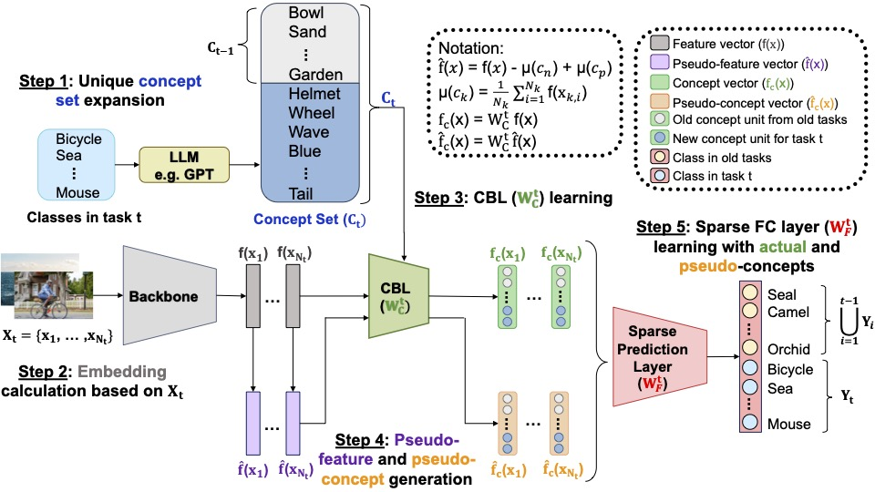
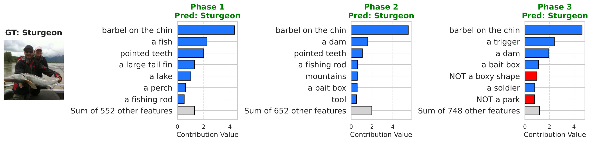
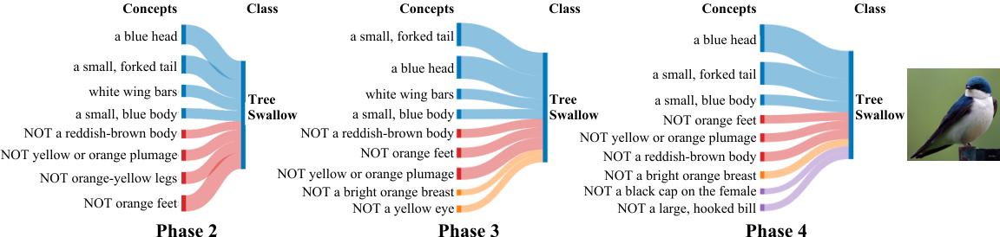

## Official implementation of “CI-CBM: Class-Incremental Concept Bottleneck Model for Interpretable Continual Learning“.

Published at Transactions on Machine Learning Research (TMLR).

**[Project website](https://lilywenglab.github.io/Class-Incremental-CBM/) · [Paper (arXiv)](https://arxiv.org/abs/2604.14519)**

CI-CBM is an interpretable class-incremental learning method that combines concept regularization with pseudo-concept generation, enabling both local and global explanations for decision-making throughout class-incremental phases. It maintains robust concept-based reasoning as new classes are introduced, substantially outperforms prior interpretable continual-learning methods, and remains competitive with black-box baselines in both pretrained and non-pretrained settings.

## Model overview and visual results

<div align="center">







</div>

## Setup
To set up the environment and download necessary datasets and models, follow the instructions below.

1. Install Python (Version 3.8 is recommended.)
2. Install dependencies by running `pip install -r requirements.txt`
3. Install CLIP and SigLip: `pip install git+https://github.com/openai/CLIP.git` and `pip install open_clip_torch`
4. Download the datasets by following files in the `dataset_download` folder:
   * CUB: `bash download_cub.sh`
   * ImageNet Subset: `bash download_imagenetsubset.sh` and `imagenet_val_grouping.py`
   * TinyImageNet: `bash download_tinyimagenet` and group the validation samples by their class using `tinyimagenet_val_grouping.py`
   * ImageNet: `bash download_imagenet.sh` and group the validation samples by their class using `imagenet_val_grouping.py`
   * **Set dataset paths:** After downloading, open `data_utils.py` and replace `YOUR_PATH_TO_DATASET` with the path to your dataset directory (e.g., the folder containing CUB, ImageNet, tiny-imagenet-200, etc.).
5. Download pretrained backbones (as needed for your experiments):
   * From the project root, run:
     ```bash
     cd backbone_download
     bash download_rn18_places.sh
     bash download_rn18_FeTrIL.sh
     bash download_apg.sh
     ```
   * Each script moves to the project root, creates `backbone_checkpoints/`, downloads the files there, then returns to the project root.

## Running the models

### 1. Train CI-CBM

Train a Class-Incremental Concept Bottleneck Model by running `main.py` (see `training_commands.md` for examples).

Important parameters:
* **seed**: Random seed (default: 1993)
* **backbone**: One of the backbones listed above
* **strategy**: `backbone_prototype` (default), `naive`, or `full_rehearsal`
* **clip_name**: CLIP or SigLIP model for concept alignment (e.g. `ViT-B/16`, `ViT-L-16-SigLIP-384`)
* **dataset**: cifar10, cifar100, cub, tiny_imagenet, imagenetsubset, places365
* **SAGA_lr**: Learning rate for final layer (default: 0.1)
* **n_iters**: Iterations for final layer (default: 1000)
* **lam**: Sparsity regularization (default: 0.0007)
* **n_experiences**: Number of incremental phases
* **half_split**: Use large first phase; required for first-phase trained backbones

### 2. Evaluate trained models

Evaluate the trained models by running `evaluate_cbm.py` codes in the `training_commands.md` to calculate metrics. 

## Citation

If you use this code or our method in your research, please cite:

```bibtex
@article{javadi2026ci,
  title={CI-CBM: Class-Incremental Concept Bottleneck Model for Interpretable Continual Learning},
  author={Javadi, Amirhosein and Oikarinen, Tuomas and Javidi, Tara and Weng, Tsui-Wei},
  journal={Transactions on Machine Learning Research},
  year={2026},
}
```

This implementation uses FeTrIL and APG pretrained backbones (via `backbone_download/`) and sparse final-layer training based on SAGA (see `glm_saga/`). The official repositories for those components are:

* **FeTrIL:** [github.com/GregoirePetit/FeTrIL](https://github.com/GregoirePetit/FeTrIL)
* **APG:** [github.com/TOM-tym/APG](https://github.com/TOM-tym/APG)
* **SAGA (sparse final layer training):** [github.com/MadryLab/glm_saga](https://github.com/MadryLab/glm_saga)